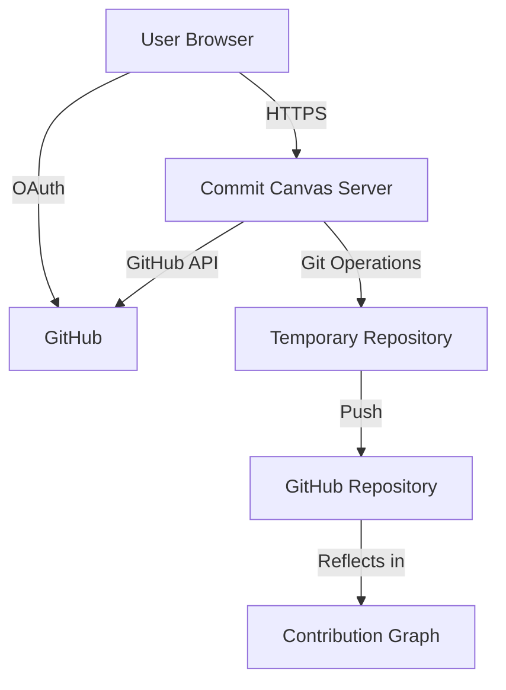

# Commit Canvas

<div align="center">

[](https://goreportcard.com/report/github.com/in-jun/commit-canvas)
[](https://opensource.org/licenses/MIT)
[](https://github.com/in-jun/commit-canvas/releases)

> 🎨 Turn your GitHub contribution graph into a canvas for artistic expression

Transform your GitHub contribution graph into beautiful patterns and designs. Create meaningful art with your commits while maintaining a professional developer profile.

[**🚀 Try it now**](https://commit-canvas.ijw.app) | [**📖 Documentation**](#documentation) | [**🤝 Contributing**](#contributing)

</div>

---

## ✨ Features

### 🎯 Core Functionality

- **🔐 Secure Authentication**: GitHub OAuth integration for safe and easy login
- **📊 Real-time Visualization**: Live preview of your current contribution graph
- **🎨 Pattern Designer**: Intuitive click-to-design interface for creating custom patterns
- **⚡ Automated Repository Management**: Automatic repository creation and commit generation
- **🌍 Global Timezone Support**: Works correctly across all timezones
- **📱 Responsive Design**: Optimized for desktop and mobile devices

### 🛡️ Safety & Security

- **🔒 OAuth 2.0**: Secure GitHub authentication
- **🏠 Private Repositories**: Option to create private pattern repositories
- **🌿 Separate Branch**: Creates commits in a dedicated `commit-canvas` branch
- **✅ Validation**: Input validation and error handling
- **🧹 Clean Separation**: Doesn't interfere with your existing repositories

---

## 🚀 Quick Start

### Prerequisites

- A GitHub account
- Modern web browser (Chrome, Firefox, Safari, Edge)
- Internet connection

### Usage

1. **Visit the Application**

   ```
   https://commit-canvas.ijw.app
   ```

2. **Authenticate with GitHub**

   - Click "Login with GitHub"
   - Authorize the application
   - You'll be redirected back to the canvas

3. **Design Your Pattern**

   - Click on cells in the contribution graph to create your pattern
   - Use the legend to understand existing vs. new contributions
   - Preview your design in real-time

4. **Create Your Repository**

   - Enter a unique repository name
   - Click "Create Pattern"
   - Wait for the magic to happen ✨

5. **View Your Results**
   - Check your GitHub profile
   - Your new pattern will appear in the contribution graph
   - Share your creative commit art with the world!

---

## 🛠️ Technology Stack

| Technology      | Purpose            | Version |
| --------------- | ------------------ | ------- |
| **Go**          | Backend server     | 1.23+   |
| **Gin**         | Web framework      | v1.10.0 |
| **go-git**      | Git operations     | v5.12.0 |
| **go-github**   | GitHub API client  | v45.2.0 |
| **OAuth2**      | Authentication     | v0.23.0 |
| **HTML/CSS/JS** | Frontend interface | ES6+    |

---

## 🏗️ Architecture



### Key Components

- **Web Server**: Gin-based HTTP server handling requests
- **Authentication**: GitHub OAuth 2.0 flow
- **Pattern Engine**: Converts UI patterns to commit schedules
- **Git Manager**: Creates and manages repositories and commits
- **Frontend**: Interactive contribution graph designer

---

## ⚠️ Important Considerations

### GitHub Terms of Service

- This tool creates legitimate commits with real content
- All commits include proper attribution and timestamps
- Repositories are created transparently in your account
- Follows GitHub's guidelines for automated content

### Best Practices

- Use meaningful repository names
- Don't create excessive patterns (be considerate)
- Understand that patterns become part of your public profile
- Consider the impact on your contribution statistics

### Limitations

- Patterns may take up to 24 hours to fully appear due to GitHub caching
- Limited to 53 weeks of history (GitHub's standard view)
- Requires public repositories for patterns to be visible in contribution graphs
- Cannot modify existing commits or repositories

---

## 🔧 Local Development

### Prerequisites

- Go 1.23 or higher
- Git
- GitHub OAuth App credentials

### Setup

1. **Clone the repository**

   ```bash
   git clone https://github.com/in-jun/commit-canvas.git
   cd commit-canvas
   ```

2. **Install dependencies**

   ```bash
   go mod download
   ```

3. **Set up environment variables**

   ```bash
   export GITHUB_CLIENT_ID="your_github_client_id"
   export GITHUB_CLIENT_SECRET="your_github_client_secret"
   export GITHUB_REDIRECT_URL="http://localhost:8080/callback"
   export SESSION_SECRET="your_random_session_secret"
   ```

4. **Run the application**

   ```bash
   go run main.go
   ```

5. **Open in browser**
   ```
   http://localhost:8080
   ```

### Docker Deployment

```bash
# Build the image
docker build -t commit-canvas .

# Run the container
docker run -p 8080:8080 \
  -e GITHUB_CLIENT_ID="your_client_id" \
  -e GITHUB_CLIENT_SECRET="your_client_secret" \
  -e GITHUB_REDIRECT_URL="your_redirect_url" \
  -e SESSION_SECRET="your_session_secret" \
  commit-canvas
```

---

## 🔐 Security Features

- **Secure Session Management**: HTTP-only cookies with proper security headers
- **CSRF Protection**: State parameter validation in OAuth flow
- **Input Validation**: Server-side validation of all user inputs
- **Rate Limiting**: Protection against abuse (recommended for production)
- **Secure Headers**: HTTPS enforcement and security headers
- **Minimal Permissions**: Only requests necessary GitHub permissions

---

## 🤝 Contributing

We welcome contributions! Here's how you can help:

### Types of Contributions

- 🐛 **Bug Reports**: Found an issue? Let us know!
- 💡 **Feature Requests**: Have an idea? We'd love to hear it!
- 🔧 **Code Contributions**: Submit pull requests
- 📚 **Documentation**: Help improve our docs
- 🌍 **Translations**: Help make the app accessible worldwide

### Development Workflow

1. **Fork** the repository
2. **Create** a feature branch (`git checkout -b feature/amazing-feature`)
3. **Commit** your changes (`git commit -m 'Add amazing feature'`)
4. **Push** to the branch (`git push origin feature/amazing-feature`)
5. **Open** a Pull Request

### Code Style

- Follow Go best practices and conventions
- Use `go fmt` for formatting
- Add comments for complex logic
- Include tests for new features

---

## 📊 Project Status

- ✅ **MVP Complete**: Core functionality implemented
- ✅ **Security Audit**: Basic security measures in place
- ✅ **Mobile Support**: Responsive design implemented
- 🚧 **Enhanced Patterns**: Advanced pattern templates (coming soon)
- 🚧 **Pattern Sharing**: Community pattern gallery (planned)
- 🚧 **Analytics**: Pattern performance metrics (planned)

---

## 🙋‍♂️ FAQ

<details>
<summary><strong>Can I delete repositories created by Commit Canvas?</strong></summary>

Yes! You have full control over repositories created by Commit Canvas. You can delete them directly from your GitHub account at any time. The patterns will disappear from your contribution graph accordingly.

</details>

<details>
<summary><strong>How long does it take for patterns to appear?</strong></summary>

Patterns typically appear immediately, but GitHub's contribution graph cache may take up to 24 hours to fully update. This is a GitHub limitation, not specific to Commit Canvas.

</details>

<details>
<summary><strong>Are the commits "real" commits?</strong></summary>

Yes! Commit Canvas creates legitimate Git commits with real content, proper timestamps, and author information. These are not fake or empty commits.

</details>

<details>
<summary><strong>Can I use this with private repositories?</strong></summary>

While you can create private repositories, contributions to private repositories don't appear in your public contribution graph unless you enable "Private contributions" in your GitHub profile settings.

</details>

<details>
<summary><strong>Does this violate GitHub's terms of service?</strong></summary>

No. Commit Canvas creates legitimate repositories with real commits and content. All activity is transparent and follows GitHub's guidelines for automated content creation.

</details>

---

## 📄 License

This project is licensed under the MIT License - see the [LICENSE](LICENSE) file for details.

---

## 🙏 Acknowledgments

- **GitHub** for providing the excellent API and platform
- **Go Community** for the amazing ecosystem of libraries
- **Contributors** who have helped improve this project
- **Users** who create beautiful art with their commits

---

## 📞 Support

- 🐛 **Bug Reports**: [Create an issue](https://github.com/in-jun/commit-canvas/issues/new?template=bug_report.md)
- 💡 **Feature Requests**: [Request a feature](https://github.com/in-jun/commit-canvas/issues/new?template=feature_request.md)
- 💬 **Questions**: [Start a discussion](https://github.com/in-jun/commit-canvas/discussions)
- 📧 **Contact**: [injun0607@naver.com](mailto:injun0607@naver.com)

---

<div align="center">

**[⬆ Back to Top](#commit-canvas)**

Made with ❤️ by [injun](https://github.com/in-jun)

⭐ **Star this repo if you found it useful!** ⭐

</div>
