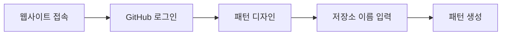

# GitHub Commit Canvas

<div align="center">

[](https://goreportcard.com/report/github.com/in-jun/commit-canvas)

> 🎨 GitHub 컨트리뷰션 그래프를 캔버스로 변환하는 도구

</div>

---

## 📋 목차

- [Features](#-features)
- [Getting Started](#-getting-started)
  - [Prerequisites](#prerequisites)
  - [Installation](#installation)
- [Usage](#-usage)
  - [Quick Start](#quick-start)
  - [Examples](#examples)
- [Tech Stack](#-tech-stack)
- [Precautions](#️-precautions)
- [Troubleshooting](#-troubleshooting)
- [FAQs](#-faqs)

---

## ✨ Features

GitHub Commit Canvas는 GitHub 컨트리뷰션 그래프에 원하는 패턴을 그릴 수 있게 해주는 웹 애플리케이션입니다.

### 핵심 기능

- 🔐 **간편한 인증**

  - GitHub OAuth를 통한 원클릭 로그인
  - 안전한 사용자 인증 처리

- 📊 **데이터 시각화**

  - 지난 1년간의 컨트리뷰션 데이터 시각화
  - 실시간 미리보기 지원

- 🎨 **패턴 디자인**

  - 직관적인 캔버스 인터페이스
  - 커스텀 패턴 디자인 및 적용
  - 자동 저장 기능

- 🔄 **자동화**
  - 자동 저장소 생성
  - 커밋 자동 관리
  - 패턴 적용 진행률 표시

---

## 🚀 Getting Started

### Prerequisites

시작하기 전에 다음 요구사항을 확인하세요:

| 요구사항    | 설명                                     |
| ----------- | ---------------------------------------- |
| GitHub 계정 | 유효한 GitHub 계정이 필요합니다          |
| 웹 브라우저 | 최신 버전의 Chrome, Firefox, Safari 권장 |
| 인터넷 연결 | 인터넷 연결 필요                |

### Installation

별도의 설치 과정 없이 웹 브라우저에서 바로 사용 가능합니다:

```bash
# 웹 브라우저에서 접속
https://commit-canvas.ijw.app
```

---

## 📖 Usage

### Quick Start



1. **웹사이트 접속 및 로그인**

```bash
# 브라우저에서 접속
https://commit-canvas.ijw.app

# GitHub 계정으로 로그인
```

2. **패턴 생성**

```bash
# 1. 캔버스에서 패턴 디자인
# 2. 저장소 이름 입력
# 3. "Create Pattern" 버튼 클릭
```

### Examples

**기본 패턴 생성**

```bash
1. 캔버스에서 셀 클릭하여 패턴 디자인
2. 저장소 이름: "commit-pattern" 입력
3. Create Pattern 클릭
```

---

## 🛠 Tech Stack

| 기술              | 용도                 | 버전    |
| ----------------- | -------------------- | ------- |
| Gin Web Framework | 백엔드 웹 프레임워크 | v1.9.1  |
| go-git            | Git 작업 처리        | v5.8.1  |
| go-github         | GitHub API 연동      | v53.2.0 |
| oauth2            | OAuth 인증 처리      | v0.13.0 |

---

## ⚠️ Precautions

### 사용시 주의사항

| 주의사항          | 설명                                              |
| ----------------- | ------------------------------------------------- |
| 컨트리뷰션 그래프 | 공개 프로필의 컨트리뷰션 그래프에 영향을 미칩니다 |
| GitHub 이용약관   | GitHub의 이용약관을 준수하여 사용해주세요         |
| 사용 제한         | 과도한 패턴 생성은 자제해주세요                   |

---

## 🔍 Troubleshooting

### 공통 문제

**로그인 실패**

1. GitHub 계정 상태 확인
2. 브라우저 캐시 삭제
3. 새 브라우저 창에서 시도

**패턴 생성 실패**

1. 인터넷 연결상태 확인

---

## 💡 FAQs

**Q: 생성된 저장소는 삭제할 수 있나요?**

- GitHub에서 직접 저장소 삭제 가능
- 삭제 후 패턴 재생성 가능

**Q: 패턴이 적용되는데 얼마나 걸리나요?**

- 일반적으로 즉시 반영
- GitHub 캐시로 인해 최대 24시간 소요 가능

---

<div align="center">

**[맨 위로 올라가기](#github-commit-canvas)**

Made with ❤️ by [injun](https://github.com/in-jun)

</div>
